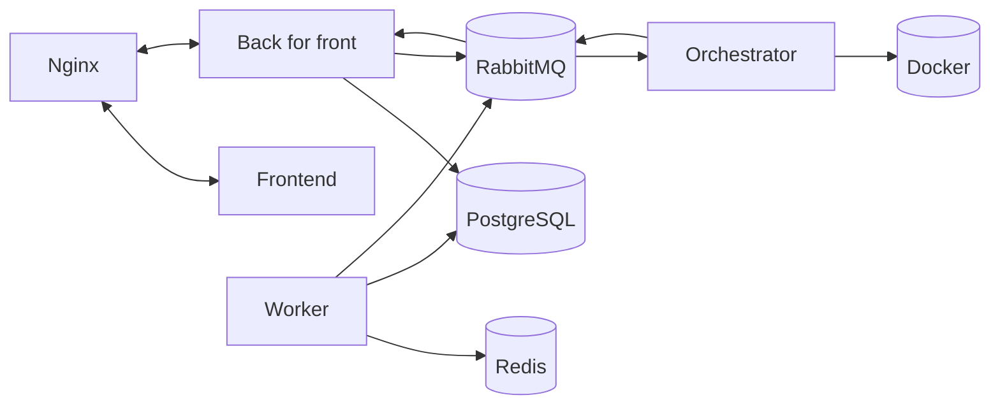

# Project struct

## Концепция

Реализовать MVP для отправки и получения сообщений из docker-контейнера с frontend.

## Используемый стек технологий

- Python 3.10
    - SqlAlchemy
    - FastAPI
    - SocketIO
    - Celery
    - AioPika
- Java Script
    - React
    - AntD
    - XTerm
- PostgreSQL
- Redis
- RabbitMQ
- Nginx
- Docker
    - Compose

## Основные компоненты системы

**Frontend** - клиентское приложение.

**BFF** - пользовательский API открытый в интернет.

**Orchestrator** - занимается управлением контейнерами, в которых работают пользователи.

**Worker** - cron задачи на очистку ресурсов.

## Схема взаимодействия

